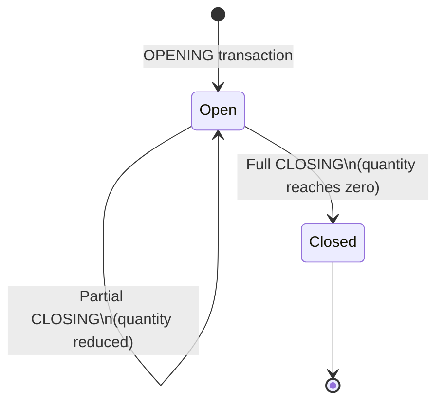
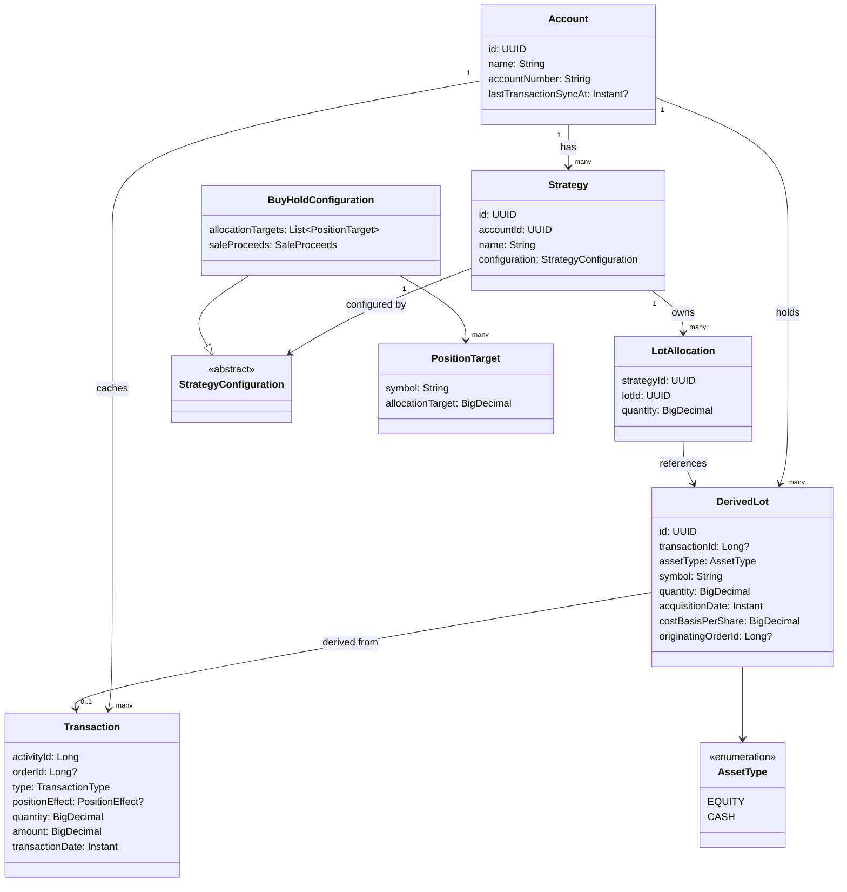
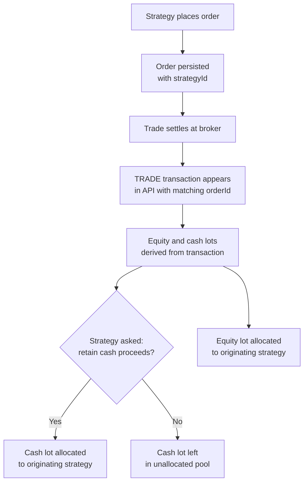
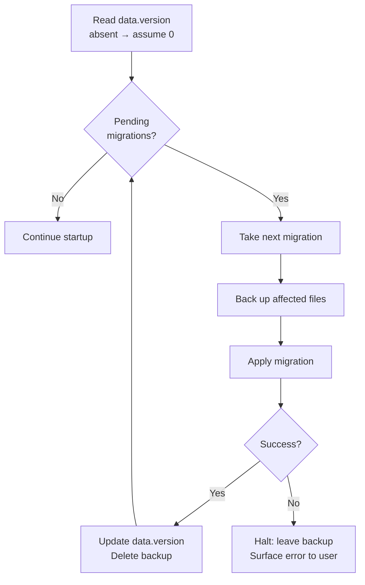

# Design: Lot-Based Strategy Isolation

**Status:** Draft

---

## Problem Statement

The current model has one strategy per account, and it operates over the account's entire position set. This creates
three classes of problems:

1. **Interference between managed and unmanaged assets.** Positions bought outside the strategy (e.g., a long-term hold,
   an employer stock grant) distort allocation math and can receive unwanted recommendations.
2. **No multi-strategy support.** Two strategies cannot independently manage different subsets of the same account —
   there is no way to say "this AAPL lot belongs to my growth strategy, that AAPL lot belongs to my income strategy."
3. **Cash is a shared, uncontrolled resource.** Any strategy can theoretically recommend using all available cash, and
   there is no concept of budgeting cash to a specific strategy.

---

## Goals

- A strategy operates only over the assets explicitly assigned to it.
- Two strategies may hold different lots of the same symbol without interfering with each other.
- Cash starts unallocated and must be explicitly assigned to a strategy before that strategy can use it.
- Unmanaged positions (lots not assigned to any strategy) are visible but inert — no strategy touches them.
- The application tracks which orders came from which strategy so that resulting lots can be attributed correctly.
- The model is forward-compatible with partial lot assignment across strategies (a future concern; not required now).

---

## Core Concepts

### Lots

A **lot** is the atomic unit of ownership. Every purchase of a security creates a lot with a specific acquisition date,
quantity, and cost basis. A position (e.g., "I own AAPL") is the sum of one or more lots. The Schwab API does not expose
lots directly; they are derived by the application from transaction history (see below).

Every lot has an **asset type**. Cash is not a separate concept — it is an asset type like any other. A cash lot has a
fixed 1:1 relationship with currency: one unit of quantity equals one unit of account currency. This means cash and
equity positions are managed through the same lot and allocation mechanisms, with no special-casing anywhere in the
model.

### The Two-Layer Lot Model

The application maintains its own lot model derived from transactions. On top of that, it maintains a separate layer of
**lot allocations** that records which lots belong to which strategy. The broker is unaware of strategies entirely.

This separation matters because:

- Lot data is reconstructed locally from API history, not fetched as a first-class resource.
- It supports future partial lot allocation.

### Strategies

A **strategy** is a named, isolated portfolio manager scoped to a single account. It owns a set of lot allocations —
including cash lots. Its view of the world — positions, total value, allocation percentages — is derived entirely from
what it has been assigned. It is unaffected by anything outside its allocation.

---

## Lot Derivation from Transaction History

Since the Schwab API has no lot endpoint, lots are reconstructed by replaying transactions in chronological order.
Because cash is treated as an asset type, both equity and cash lots are derived from the transaction log. The existing
`TransactionsClient` supports fetching by account, date range, and transaction type; `TransferItem.positionEffect`
carries the open/close semantics needed for equity, and cash-flow transaction types handle cash.

**Equity lots** are derived from `TRADE` transactions using `positionEffect`:

- **`OPENING`** — creates a new equity lot. Acquisition date, quantity, and cost basis are read from the transaction.
- **`CLOSING`** — reduces or removes equity lots in FIFO order. A partial close splits the oldest lot; a full close
  removes it.

**Cash lots** are derived from cash-flow transactions (`ACH_RECEIPT`, `ACH_DISBURSEMENT`, `CASH_RECEIPT`,
`CASH_DISBURSEMENT`, `WIRE_IN`, `WIRE_OUT`, and the cash leg of settled `TRADE` transactions). Deposits and trade
proceeds create cash lots; withdrawals and trade purchases consume them in FIFO order. Each cash lot records the date
and amount; cost basis per unit is always 1.0 by definition.

The `Transaction.orderId` field links a settled trade back to the order that caused it, which is how lot attribution to
a strategy is established (see below).

### Transaction History Persistence

The Schwab API returns at most one year of history per request. The application caches transaction history locally so
that lot derivation does not require a full re-fetch on every startup. The brokerage is the ground truth; the local
cache is a performance convenience and is always reconcilable against the API.

### Bootstrapping on First Run

On first run for an existing account, the application scans back 10 years in one-month increments, making one API call
per month to stay well under the 3,000-transaction-per-response limit. This produces the deepest possible history from
the API.

After replaying all available transactions, the resulting derived lots are compared against the account's actual
positions (which are available directly from the account API). Any discrepancy — shares the account holds that no
derived lot accounts for — is resolved by creating a single **correction lot** per affected symbol. The correction lot
is dated 10 years and 1 day ago, which guarantees FIFO ordering places it before all other lots. Its quantity is the
unaccounted-for share count; its cost basis per share is taken from the account's reported average cost for that symbol.
The same reconciliation applies to cash: if the account's reported cash balance exceeds what the derived cash lots sum
to, a correction cash lot is created with the difference, also dated 10 years and 1 day ago.

This approach ensures the application's lot model is always consistent with the broker's reported positions, even for
holdings that predate available API history.

### Incremental Sync

After the initial bootstrapping scan, the transaction cache is kept current as part of the normal refresh workflow that
already fetches new prices. Each account stores a `lastTransactionSyncAt` timestamp (nullable; absent means
bootstrapping has not yet completed). On every refresh, the application fetches all transactions with a start date equal
to `lastTransactionSyncAt` and an end date of now, then merges the results into the cache. Transactions are deduplicated
by `activityId` before persisting, so overlapping windows — which are used to avoid missing transactions that arrive
late relative to their settlement date — do not corrupt the cache. On a successful sync, `lastTransactionSyncAt` is
updated to the current time. If the sync fails, the timestamp is left unchanged so the next refresh retries from the
same watermark.

New transactions discovered during an incremental sync are processed through the same lot derivation and attribution
pipeline as bootstrapped transactions. Newly derived lots that can be matched to a strategy via `orderId` are attributed
automatically; all others are placed in the unallocated pool for the user to assign.

### Lot State Machine

---

## Data Model

**Derived at runtime:**

- A strategy's **position in a symbol** = sum of quantities across its `LotAllocation` entries for lots where
  `assetType = EQUITY` and `symbol` matches.
- A strategy's **available cash** = sum of quantities across its `LotAllocation` entries for lots where
  `assetType = CASH`.
- A strategy's **total value** = sum of (equity lot quantity × current price) + available cash.
- **Unallocated lots** (of any asset type) = derived lots with no `LotAllocation` entry pointing to them.

**For cash lots, `symbol` holds the ISO 4217 currency code (e.g., `"USD"`, `"EUR"`). This allows the portfolio view to
group cash by currency and supports future FOREX lot tracking without a schema change. Domestic accounts will have only
`"USD"` cash lots; the 1:1 exchange rate is implicit.

**`DerivedLot` identity** uses two separate fields. `id` is a random UUID generated at the time the record is created
and serves as the stable primary key referenced by `LotAllocation`. `transactionId` is a nullable `Long` that is a
foreign key into the cached `Transaction` feed. The Schwab API exposes three int64 candidates for this link —
`activityId`, `positionId`, and `orderId` — of which `activityId` is the transaction-level identifier used here.
`transactionId` is null for correction lots and any other lot that cannot be traced to a specific fetched transaction.

`originatingOrderId` is nullable. Lots derived from orders placed by a strategy carry the order ID that links them back
through the attribution pipeline. Correction lots and lots bootstrapped from pre-history positions have no originating
order and carry `null`. The attribution pipeline treats a null order ID as unattributed — the lot is placed in the
unallocated pool pending explicit user assignment.

**Partial lot allocation** is supported from the start. A single `DerivedLot` may have `LotAllocation` entries from
multiple strategies so long as the sum of allocated quantities does not exceed the lot's total quantity. This is
required not just for cross-strategy splitting but for the ordinary case of a partial sell: when only some shares of a
lot are sold, the remaining shares must remain attributable to the strategy that owned them.

**`StrategyConfiguration`** is a polymorphic type. Each strategy implementation declares its own configuration subtype
carrying only the fields that strategy needs. The `Strategy` entity itself holds only the concerns universal across all
strategy types: identity and lot ownership (cash included). `BuyHoldConfiguration` is the first concrete subtype,
carrying allocation targets and a `saleProceeds` default. Future strategy types introduce their own subtypes without
touching the `Strategy` model.

`saleProceeds` on `BuyHoldConfiguration` is a configuration default, not a hard rule. The actual attribution decision
for a given sale is made by the strategy engine at runtime — the engine is asked whether proceeds from a specific sale
should be retained in the strategy or released to the unallocated pool. For `BuyHoldStrategy` the answer may simply
reflect the configured default, but the interface leaves room for strategies that make context-sensitive decisions (
e.g., release proceeds when the sold position was at or above its target, retain when it was underweight).

---

## Lot Attribution Pipeline

When a strategy places orders, the resulting settled trades are linked back to that strategy via `orderId`. The full
flow:

The equity side is always attributed to the originating strategy — the strategy initiated the purchase, so it owns the
resulting shares. The cash side of a sale is where the attribution decision is made: the strategy engine is consulted at
the point the cash lot is created, and it returns whether those proceeds belong to the strategy or to the unallocated
pool. This is a runtime call to the strategy, not a static flag lookup, so strategies may base the decision on context
such as current allocation state.

For now, the matching assumption for equity is simple: all lots produced by a strategy's orders are attributed wholly to
that strategy. Future work could support bulk ordering across strategies with lot subdivision.

---

## Persistence

Three new stores are needed per account, on top of what already exists:

1. **Transaction history** — a local cache of fetched transactions per account. The lot derivation algorithm runs over
   this cache; the brokerage API remains the ground truth.
2. **Strategies** — name, id, allocated cash, and allocation targets. Replaces the current per-account `PositionTarget`
   list, which becomes a property of a specific strategy.
3. **Lot allocations** — the mapping from lot IDs to strategy IDs with quantities. This is the application's own record;
   the broker never sees it.

**Polymorphic serialization:** `StrategyConfiguration` is an abstract type with concrete subtypes (
`BuyHoldConfiguration` and any future additions). `kotlinx.serialization` does not resolve polymorphism automatically —
each subtype must carry a `@SerialName` annotation and be registered in a `SerializersModule` supplied to the JSON codec
used by the Strategy repository. Without this registration, deserializing a persisted `Strategy` file will throw at
runtime. The Strategy repository is responsible for constructing and owning this module. Any new `StrategyConfiguration`
subtype must be added to the module at the same time it is introduced.

---

## UI Brainstorm

The current UI is a single flat table per account. That mental model breaks down with multiple strategies. Several
approaches are worth considering:

### Option A — Strategy sub-tabs within each account tab

Each account tab gains a nested tab bar. The first tab is a **Portfolio Overview** showing all derived lots grouped by
symbol, unallocated cash, and lot assignment controls. Each subsequent tab represents one strategy and shows only that
strategy's lots, targets, recommendations, and cash.

- **Strengths:** Each strategy is a self-contained view. Familiar tab metaphor. Clean isolation.
- **Weaknesses:** Tab proliferation if an account has many strategies. Hard to compare strategies side by side. Lot
  assignment requires switching between tabs.

### Option B — Strategy selector with an adaptive single view

Each account tab keeps a single content area but adds a strategy selector (dropdown or segmented control) at the top.
Selecting "Portfolio" shows all lots and unallocated resources. Selecting a strategy filters the view to that strategy's
holdings, targets, and recommendations.

- **Strengths:** Compact. Keeps the familiar single-table UX for users with one strategy.
- **Weaknesses:** One strategy visible at a time. Lot assignment still requires navigating between views.

### Option C — Split panel: portfolio on the left, strategy on the right

Each account tab is split vertically. The left panel shows the full derived portfolio (all lots grouped by symbol,
unallocated cash). The right panel shows the selected strategy. Lot assignment is done directly — selecting a symbol or
lot in the left panel and using a right-click or button action to assign it to the strategy shown on the right.

- **Strengths:** The full account context is always visible while managing a strategy. Assignment is direct and spatial.
  Good for initial setup and auditing.
- **Weaknesses:** More complex layout. May feel cramped on smaller screens.

### Option D — Separate "Manage Strategies" workflow

The account tab shows only an aggregate portfolio view. Strategy management (creation, lot assignment, cash allocation,
targets, recommendations) lives in a dedicated panel launched from a menu or button. The main tab stays simple; the
dedicated view is where the work happens.

- **Strengths:** Clean separation of "viewing the account" from "managing strategies." Reduces complexity in the main
  view.
- **Weaknesses:** Important strategy info (recommendations) is one level removed from the main flow.

---

## Lot Assignment UI

Regardless of layout option, the lot assignment interaction must support:

- **Assign all lots of a symbol to a strategy** — the common case; a single action (e.g., right-click on a symbol → "
  Assign all [AAPL] lots to…" → pick strategy).
- **Assign individual lots** — for fine-grained control (assign only the 2021 lot to Strategy A, keep the 2023 lot
  unallocated).
- **Reassign lots between strategies** — move an allocation from one strategy to another without going through the
  unallocated pool as an intermediate step.
- **View lot status at a glance** — the portfolio view should show for each lot whether it is unallocated or which
  strategy owns it.

---

## Cash Allocation UI

Because cash is an asset type rather than a special field, assigning cash to a strategy is the same operation as
assigning equity lots — the user selects cash lots from the unallocated pool and assigns them to a strategy. The lot
assignment UI therefore handles both cases without a separate cash workflow.

The portfolio view should make cash lots visually distinguishable from equity lots (e.g., grouped under a "Cash" entry
rather than a symbol row) so that the user can identify and select them easily. The same assign / reassign /
return-to-unallocated interactions apply.

## Data Migration

### Framework

A `data.version` file in the application data directory records the current schema version as a plain integer. If the
file is absent, version 0 is assumed. On every startup, the migration runner reads this version and applies any
migrations whose version is higher, in sequence.

The migration list is a static ordered collection defined in the runner class. Adding a new migration means appending a
new entry to that list — no dynamic discovery or reflection. Each entry is responsible for:

1. **Backing up** the specific files it will modify, written to a sibling backup path.
2. **Performing** the migration.
3. On success: **updating** `data.version` to the new version number and **deleting** the backup.
4. On failure: leaving the backup in place for inspection. The runner halts and surfaces the error rather than
   attempting subsequent migrations.

Migrations run before the UI appears and before any services are initialized, so no service layer can observe a
partially migrated state.

### Migration flow

### Version 0 → 1: PositionTarget to Strategy

The first migration converts the existing flat `PositionTarget` files into the new `Strategy` model.

For each account that has a persisted `PositionTarget` list:

- Create a default `Strategy` named after the account with a `BuyHoldConfiguration` containing those targets and the
  default `saleProceeds` setting.
- Write the new strategy file.
- Remove the old target file once the strategy file is confirmed written.

The bootstrapping lot scan (10-year history fetch and correction lot generation) is not part of this migration — it runs
as a first-launch operation within the normal startup flow after migration completes, since it depends on live API
access.

---

## Open Questions

1. **Recommended UI option** — Options A through D are preserved in the UI Brainstorm section for context. The final
   layout decision will be made based on POC mockups, which are not yet ready. UI implementation is blocked until a
   layout is selected.

---

## Out of Scope

### Corporate Actions

Stock splits, reverse splits, spin-offs, and reinvested dividends are explicitly out of scope for this implementation.
These events modify lot quantities and cost bases in ways that fall outside the `OPENING` / `CLOSING` `positionEffect`
model used for lot derivation. A 2-for-1 split, for example, doubles share count without a corresponding `OPENING`
transaction; processing a subsequent sell without accounting for it would yield incorrect FIFO results.

The reconciliation path when a corporate action occurs is the existing correction lot mechanism: the next position sync
will detect a discrepancy between the derived lot total and the broker's reported position and generate a correction lot
to close the gap. This keeps the quantity model correct at the cost of losing cost basis accuracy for affected shares —
the same trade-off already accepted for pre-history lots.

Full corporate action support (parsing adjustment transactions, applying split ratios, tracking adjusted cost basis) is
a separate future initiative.

### Rate Limiting

The Schwab API client has no rate limiting today. The first-run bootstrapping scan makes approximately 120 sequential
API calls (one per month over 10 years). Without rate limiting, this risks triggering Schwab's throttling, and
subsequent incremental syncs are also unprotected. Rate limiting support — including handling of 429 responses and
back-off — must be built into `BaseClient` before the bootstrapping scan or any high-volume transaction fetch is
implemented. This is a prerequisite for this feature.

### UI Layout

The UI layout decision (Options A–D in the UI Brainstorm section) is deferred. No implementation should begin on the UI
checklist items until POC mockups have been evaluated and a layout option has been selected.

---

## Implementation Checklist

Items within each group can generally be implemented independently. Groups must be completed before the groups that
depend on them.

- [ ] **Data models**
    - [ ] `AssetType` enumeration (EQUITY, CASH)
    - [ ] `DerivedLot` — replace `lotId: String` with `id: UUID` and `transactionId: Long?`; add `assetType` field; make
      `originatingOrderId` nullable
    - [ ] `LotAllocation` — update `lotId` type from `String` to `UUID`
    - [ ] `Transaction` — cached transaction feed model (`activityId`, `orderId`, `type`, `positionEffect`, `quantity`,
      `amount`, `transactionDate`)
    - [ ] `LotAllocation` model
    - [ ] Revised `Strategy` model — remove `allocatedCash`, add `configuration`
    - [ ] `StrategyConfiguration` abstract type
    - [ ] `BuyHoldConfiguration` concrete subtype — allocation targets, `saleProceeds` default

- [ ] **Persistence layer** *(depends on: data models)*
    - [ ] Transaction history repository — local cache of fetched transactions per account
    - [ ] Strategy repository — replaces per-account `TargetPositionRepository`
    - [ ] Lot allocation repository

- [ ] **Lot derivation** *(depends on: persistence layer)*
    - [ ] Expand transaction fetching beyond today — all relevant types over arbitrary date ranges
    - [ ] Equity lot derivation from TRADE / OPENING transactions
    - [ ] Cash lot derivation from cash-flow transaction types and the cash leg of settled trades
    - [ ] FIFO consumption algorithm — partial close splits a lot, full close removes it
    - [ ] Bootstrapping scan — fetch 10 years of history in one-month increments on first run (requires rate limiting —
      see Out of Scope)
    - [ ] Correction lot generation — reconcile derived lots against reported account positions and cash balance
    - [ ] Incremental sync — fetch transactions since `lastTransactionSyncAt` on each refresh; deduplicate by
      `activityId`; update timestamp on success
    - [ ] `Account` persistence — store and load `lastTransactionSyncAt`

- [ ] **Strategy engine update** *(depends on: data models)*
    - [ ] Update `StrategyEngine` interface — accept lot-based portfolio input instead of position list
    - [ ] Add proceeds attribution method to `StrategyEngine` — strategy returns retain/release decision for a given
      sale
    - [ ] Update `BuyHoldStrategy` to implement revised interface

- [ ] **Strategy domain service** *(depends on: persistence layer, lot derivation, strategy engine update)*
    - [ ] Strategy CRUD — create, rename strategies per account; delete only permitted when the strategy has no
      allocated lots (equity or cash)
    - [ ] Lot assignment — assign, reassign, and release lot allocations (equity and cash)
    - [ ] `AccountPositionService` refactor — derive strategy positions and unallocated pool from lot allocations

- [ ] **Order attribution** *(depends on: strategy domain service)*
    - [ ] Persist `strategyId` on placed orders
    - [ ] Match settled TRADE transactions to originating orders via `orderId`
    - [ ] Auto-attribute equity lots from strategy orders to that strategy
    - [ ] Invoke strategy engine for cash proceeds attribution decision at settlement

- [ ] **UI** *(depends on: strategy domain service; layout choice must be resolved first — see Out of Scope)*
    - [ ] Resolve UI layout option (see Out of Scope — blocked on POC mockups)
    - [ ] Portfolio overview — all lots grouped by asset type and symbol, allocation status visible per lot
    - [ ] Strategy management — create, configure, and delete strategies
    - [ ] Lot assignment interaction — assign all lots of a symbol, assign individual lots, reassign between strategies
    - [ ] Per-strategy view — owned lots, allocation targets, recommendations, available cash
    - [ ] Cash lot display — visually distinct from equity lots in both portfolio and strategy views

- [ ] **Migration framework** *(depends on: persistence layer)*
    - [ ] `data.version` file read/write — treat absence as version 0
    - [ ] Migration runner — applies pending migrations in sequence on startup, before services initialize
    - [ ] Per-migration backup/restore contract — each migration backs up affected files, deletes backup on success,
      halts on failure

- [ ] **Migration v0 → v1** *(depends on: migration framework, strategy repository)*
    - [ ] Convert existing `PositionTarget` files to default `Strategy` with `BuyHoldConfiguration`

- [ ] **First-launch bootstrapping** *(depends on: lot derivation, strategy domain service)*
    - [ ] Detect first launch (no transaction cache present) and run 10-year history scan
    - [ ] Assign all derived lots to the default strategy created by migration v0 → v1

---

## Design Review Comments

*Reviewer: Claude Code — 2026-04-19*

---

### Critical

**1. ~~First-launch bootstrapping auto-assigns all lots to the default strategy — contradicts the isolation goal.~~ (
Retracted)**

The current system does not support unmanaged assets — every position in an account must be managed by a strategy. The
v0→v1 migration therefore preserves the existing invariant by attributing all derived lots to the default strategy. This
is the correct behavior: the user's pre-migration state had all assets in one strategy, and the migration keeps that
intact. If a user later creates a second strategy and wants to move assets across, they can explicitly unallocate and
reassign at that time. The checklist item is correct as written.

**2. `originatingOrderId` on `DerivedLot` must be nullable. ✓ Applied**

Correction lots and lots bootstrapped from pre-API-history positions have no originating order. Making
`originatingOrderId` nullable (as updated in the data model above) is the correct fix. The attribution pipeline treats a
null order ID as unattributed — the lot goes to the unallocated pool pending explicit user assignment.

**3. ~~Correction lots placed at the FIFO front create durable model divergence.~~ (Retracted — FIFO quantities are
preserved)**

On further analysis, the correction lot design is sound for position quantity tracking. Because the correction lot is
always dated before all reconstructed lots, both the application and the broker's own FIFO logic select the same block
of shares first on any sell. Quantities stay in sync.

The residual concern is narrower: **cost basis display accuracy**. The correction lot uses the broker's reported average
cost rather than the true acquisition price of the pre-history shares. This is an informational inaccuracy — it does not
affect position quantities, allocation math, or the integrity of subsequent FIFO operations. It is worth a comment in
the code and a note in the UI (e.g., a tooltip on correction lots indicating that cost basis is approximate) so users
are not misled when reviewing their holdings.

---

### Significant

**4. `lotId` type and generation strategy are unspecified. ✓ Applied**

Resolved by splitting lot identity into two fields. `DerivedLot.id` is a random UUID generated at creation time and is
the stable primary key used by `LotAllocation`. `DerivedLot.transactionId` is a nullable `Long` FK into the
`Transaction` feed, using Schwab's `activityId` as the transaction-level identifier (the other int64 candidates —
`positionId` and `orderId` — are scoped to position and order respectively, not to the individual transaction).
Correction lots carry a UUID `id` with a null `transactionId`. The UUID-based primary key is now consistent with
`Strategy.id`.

**5. ~~Cash FIFO tracking adds complexity without a clear accuracy benefit.~~ (Retracted)**

The cash-as-asset-type design is intentional and forward-compatible with FOREX. USD in a domestic account is always 1:1,
but a strategy that holds foreign currency (e.g., EUR, JPY) needs lot-level tracking to accurately compute growth and
cost basis as exchange rates move over time. Treating all currency as a unified lot type — rather than special-casing
USD — keeps that path open without a future redesign. The complexity is justified.

**6. Incremental sync after first-run bootstrapping is not addressed. ✓ Applied**

Addressed by the new Incremental Sync subsection. The watermark is `lastTransactionSyncAt` stored on `Account`. Sync
runs as part of the existing refresh workflow alongside price updates. New transactions are deduplicated by `activityId`
and processed through the same attribution pipeline as bootstrapped data.

**7. Polymorphic serialization for `StrategyConfiguration` requires explicit registration. ✓ Applied**

Addressed in the Persistence section. The Strategy repository owns the `SerializersModule` registering all
`StrategyConfiguration` subtypes. Each subtype requires a `@SerialName` annotation. New subtypes must be added to the
module at the time they are introduced.

**8. Corporate actions are not mentioned even as out-of-scope. ✓ Applied**

Addressed in the Out of Scope section. Corporate actions are explicitly out of scope. The reconciliation path when they
occur is the existing correction lot mechanism: the next position sync will detect the discrepancy and generate a
correction lot.

**9. Strategy deletion lifecycle is unspecified. ✓ Applied**

Resolved with the strict deletion policy: a strategy may not be deleted while it has any allocated lots (equity or
cash). The user must unallocate or reassign all lots before deletion is permitted. This eliminates the possibility of
orphaned `LotAllocation` records. The checklist item has been updated accordingly.

---

### Minor

**10. `DerivedLot.symbol` for cash lots is unspecified. ✓ Applied**

Cash lots use the ISO 4217 currency code (e.g., `"USD"`, `"EUR"`) as their symbol. Noted in the data model section. This
also future-proofs the field for FOREX lot tracking.

**11. The first-run bootstrapping scan makes roughly 120 API calls, and no rate limiting exists. ✓ Applied**

The Schwab client (`BaseClient`) has no rate limiting today — no 429 handling, no delay between requests. This is
addressed in the Out of Scope section as a prerequisite: rate limiting must be built into `BaseClient` before the
bootstrapping scan or high-volume incremental sync is implemented. The bootstrapping checklist item is annotated with
this dependency. Progress indication via `ProgressService` is captured as part of the bootstrapping scan implementation.

**12. UI layout decision is unresolved. ✓ Applied**

Addressed in the Out of Scope section. The decision is deferred to POC mockups. All four options (A–D) are preserved in
the UI Brainstorm section for context. The Open Question and UI checklist item now reflect that this is blocked on
mockups rather than a pending judgment call.
